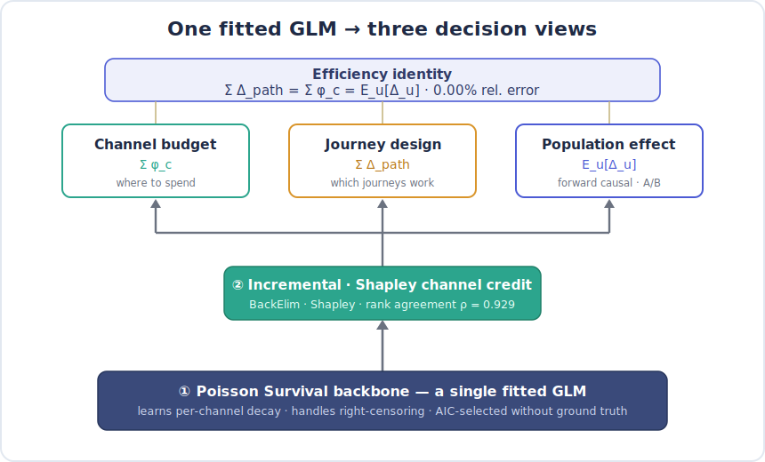
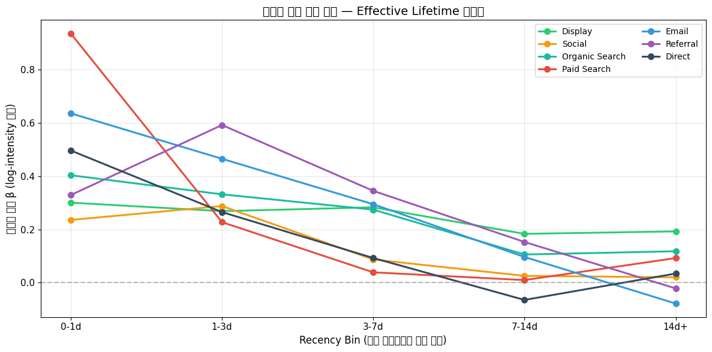
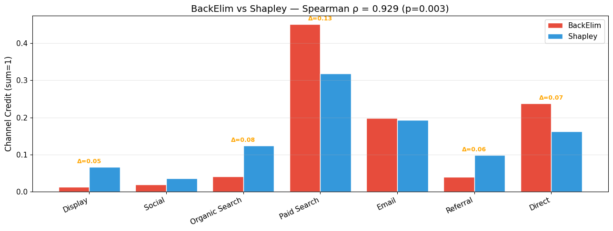
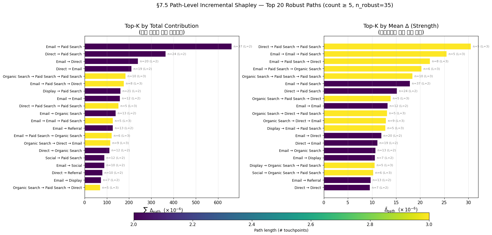
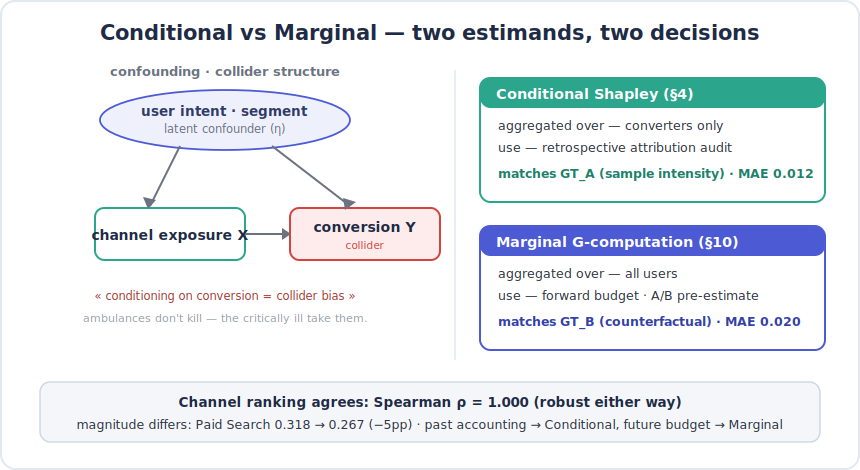
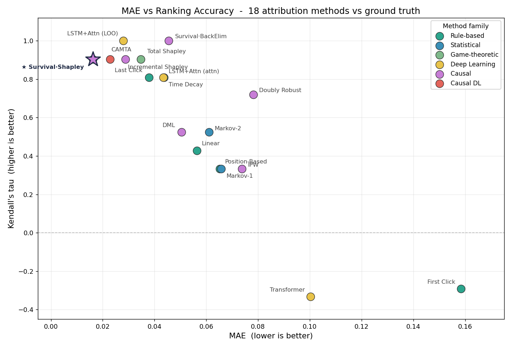
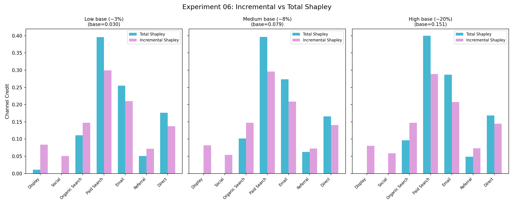
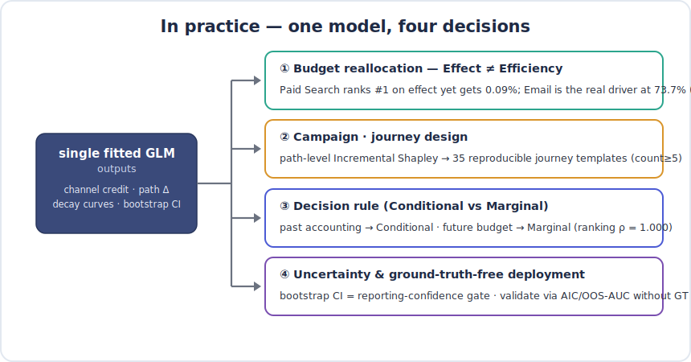
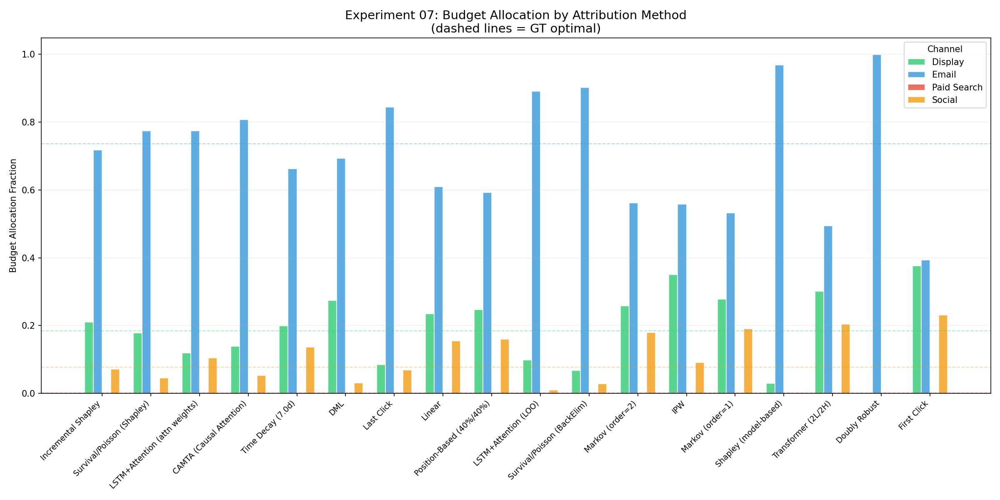
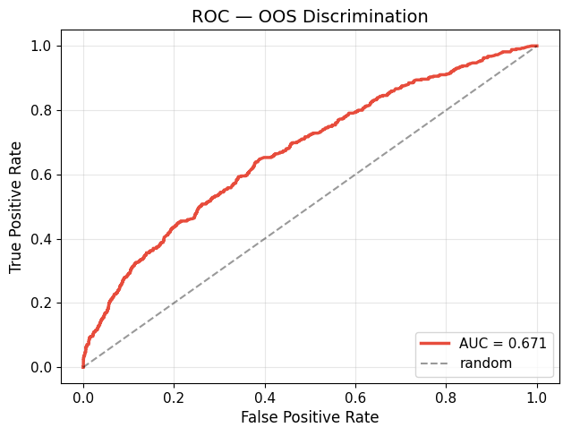

<!-- LANG-TOGGLE -->
[🇰🇷 한국어](README.md) · **🇺🇸 English**

# One survival model for channel credit, budget, and journey design — at once

### Causal multi-touch attribution: Incremental·Shapley credit and a path-level decomposition, unified on a single Inhomogeneous Poisson Process

<p align="center">
  
  
  
  
  
</p>

> **In one line.** To answer *"would this conversion have happened without the ad?"*, I model the marketing
> journey as **time-to-event (survival) data** with a single **Inhomogeneous Poisson Process (IPP)** — and stack
> **Incremental·Shapley channel credit** and a **path-level (per-journey) decomposition** on top. Against
> *simulation ground truth*, it attains the **lowest channel-credit error of 18 methods (MAE 0.016)**, while the
> *same fitted model* answers **channel budget · journey design · forward causal decisions** under a *single
> efficiency identity*.

---

## ⏱️ 30-second summary (TL;DR)

<p align="center">
  
  <br><sub><b>Figure 1.</b> A credit layer and a path layer sit on a single <b>Inhomogeneous Poisson Process</b> (backbone),
  unifying channel budget · journey design · population effect under <b>one efficiency identity (0.00% rel. error)</b> — the core thesis of this work.</sub>
</p>

- **What it is** — a causal MTA that fuses Shender et al. (2023)'s survival backbone (an **Inhomogeneous Poisson
  Process**) with Du et al. (2019)'s Incremental Shapley into a *single fitted model*, then adds **path-level
  Incremental Shapley** (per-journey decomposition) and **Conditional vs Marginal G-computation** (two estimands).
- **Why it matters** — classic MTA answers *correlation* (Last Click, Shapley). This answers *causation*
  ("what if the ad were absent?") yet needs **no A/B test** — it separates channel effect, temporal decay,
  synergy, and incremental lift from **observational data alone**.
- **What it shows** — **lowest MAE 0.016** (#1 of 18) + **2nd-best budget allocation (MAE 0.019)** + a rare
  combination of low bootstrap variance among accurate methods (method-level mean CV 0.13 — its peers
  Incremental·Total Shapley sit at 0.60·0.99). And channel·path·population views **agree to 0.00% error**.

> 📖 **Pick your depth.** 30s → above · 5min → [Problem](#1-problem--why-classic-mta-falls-short)·[Method](#2-method--why-this-three-layer-design)·[Impact](#3-impact--honest-results)·[Industry use](#4-how-its-used-in-practice) ·
> 30min → [Limitations](#5-limitations--honest-scoping)·[Reproduce](#6-reproduce-quick-start)·[Appendix: 11 experiments](#appendix-11-experiment-gallery) + [`docs/Methodology_*`](../docs).

---

## 1. Problem — why classic MTA falls short

A quarterly marketing review. No A/B test results, yet you must report which channels drove conversions and
how to shift next quarter's budget. The usual attribution carries four limitations *at the same time*.

| Limitation | What happens | Which methods are caught |
|---|---|---|
| **Correlation ≠ causation (confounding)** | Loyal users receive more Email (exposure) *and* convert more anyway (η↑). Email's raw credit is inflated. | Last Click, Linear, Markov, Total Shapley |
| **Ignores time** | Blind to *when* touches happened and how fast effects decay; depends on an arbitrary lookback window. | Rule-based broadly |
| **Misses synergy** | Cross-channel effects like "Display → Paid Search" can't be captured by a single-channel credit. | Rule-based, 1st-order Markov |
| **Predict ≠ explain** | LSTM/Transformer *predict* conversions well, but attention weights aren't guaranteed to equal *causal* credit. | Deep-learning attribution |

> **The real question**: *"Had this channel's ad been absent, would the conversion still have happened?"* —
> that is **incremental** effect, not correlation. Estimating it from observational data requires modeling
> the journey as a *timed event sequence* and subtracting the baseline conversion.

---

## 2. Method — why this three-layer design

The spine of this project is **three layers stacked on a single fitted Inhomogeneous Poisson Process (IPP)**. The
key idea: fit the model *once*, then derive channel credit, journey decomposition, and population effect as **the
same game**. The full structure is **Figure 1** above (the three-layer stack + the efficiency identity).

### 2.1 Backbone — why an Inhomogeneous Poisson Process

A marketing journey is inherently **time-to-event data**. A touch's influence decays over time, observation
windows differ per user ("no conversion within 8h" ≠ "zero effect"), and conversions are rare (2.3%). A
snapshot logistic regression throws that structure away.

- **Model class = Inhomogeneous Poisson Process**: conversions are modeled as a Poisson process whose
  *intensity* $\lambda(t)$ *varies over time*.

  $$\log \lambda_i(t) \;=\; \alpha_0 \;+\; \sum_{j}\sum_{k} \beta_k \cdot x_{jk}\cdot f_{\text{channel}}(t-t_j)$$

- **Estimation**: slice each touchpoint into time intervals and fit an **interval-split Poisson GLM**
  (offset = log Δt) — *the GLM is the estimation mechanism*, not the model-class name. Right-censoring is handled natively.
- **Let the data speak**: it *learns* a 5-bin decay curve per channel — Paid Search cools within ~1 day,
  Display lingers to ~14 days (Figure 2). No assumed lookback window.
- **No peeking at ground truth**: spec chosen by **AIC** (`+Position`, ΔAIC −435 vs baseline), fit checked by
  Deviance/df, predictive power by hold-out — the model is selected *without* ground truth (key to deployment).
- **Why a backbone**: a single IPP is fit, so every downstream credit / path / population decomposition is
  *just a different query of the same model*.

<p align="center">
  
  <br><sub><b>Figure 2.</b> The per-channel decay (β, log-intensity contribution) the IPP <i>learns</i> from data. Paid Search peaks at 0–1 day then drops
  (effective lifetime ~1 day); Display persists out to two weeks — time structure estimated directly, no lookback window assumed. <i>(Axis labels in Korean; channel/legend in English.)</i></sub>
</p>

### 2.2 Channel credit — why stack Incremental·Shapley on the backbone

A fitted intensity $\hat\lambda$ is not yet "channel credit." To decompose it per channel, I define **two
credit operators on the same IPP**.

| Operator | Definition | Property | Use |
|---|---|---|---|
| **BackElim** | Remove ads *last → first*, crediting each ad with the resulting drop in $\hat\lambda$ | order-dependent · the per-channel drops sum exactly to $\hat\lambda(\text{full})-\hat\lambda(\varnothing)$ (no remainder) | bidding (last-touch concentration) |
| **Shapley** | Average marginal contribution over 128 coalitions | order-free · coalition-fair · efficiency axiom (§2.3) | budget allocation |

The two operators agree on channel ranking at **Spearman ρ = 0.929** (Figure 3) — high agreement is a reportable,
robust signal, while large divergence is a diagnostic signal that the channel is synergy-heavy. E.g. Paid Search
is BackElim 0.45 vs Shapley 0.32 — **BackElim concentrates the credit on the last touch (Paid Search)** while
**Shapley spreads it across coalitions**. (Derivations:
[`Methodology_05`](../docs/Methodology_05_Causal_Attribution_Frameworks.md) Eq. 13·25.)

<p align="center">
  
  <br><sub><b>Figure 3.</b> Two credit operators (BackElim·Shapley) on the same IPP. Ranking agreement ρ=0.929 — a robust signal.</sub>
</p>

**Why "incremental" (vs Total Shapley).** Total Shapley credits the baseline conversion too (what would have
happened with no ads at all). It therefore over-values lower-funnel channels (Paid Search, Email) that ride
high-intent users, and **collapses to zero for upper-funnel channels (Display·Social) as the base rate rises**
(Experiment 06: at high base, Display Total = 0.00 vs Incremental = 0.080). Incremental Shapley subtracts the
baseline to isolate **only the ad-driven lift**.

### 2.3 Multi-path — why a path-level decomposition

The channel view (§2.2) answers "which channel to fund." But marketers also ask "**which N-step journeys
generate the most incremental conversions**" — a **campaign / journey-design** question, not a budget one.

- **Same IPP, different aggregation**: sum $\Delta_{\text{path}} = \hat\lambda(\text{path}) -
  \hat\lambda(\varnothing)$ at the *journey-template (ordered channel tuple)* level instead of by channel.
- **The efficiency identity unifies three views** — verified at **0.00% relative error**:

  $$\underbrace{\textstyle\sum_{\text{paths}} \Delta_{\text{path}}}_{\text{journey design}} \;=\; \underbrace{\textstyle\sum_{c} \phi_c}_{\text{channel budget}} \;=\; \underbrace{\mathbb{E}_u[\Delta_u]}_{\text{population effect}} \;=\; 6.99\times 10^{-2}$$

  i.e. channel budget, journey design, and population causal effect are *not separate analyses but three
  aggregations of the same game*.
- **Keep only what's reproducible**: of 1,786 unique templates, ~98% are one-person flukes (count=1, long
  unique journeys). A `count ≥ 5` filter keeps **35 robust templates** (covering 15.5% of converters) as
  campaign candidates (Figure 4).

<p align="center">
  
  <br><sub><b>Figure 4.</b> The 35 robust journeys ranked by path-level Incremental Shapley. <b>Left (Total Contribution)</b>:
  frequent, high-total journeys — short 2-step paths like Email→Paid Search (n=37) and Direct→Paid Search (n=24).
  <b>Right (Mean Δ)</b>: rare but high-impact-per-occurrence 3-step journeys. Color = journey length (# touchpoints).</sub>
</p>

### 2.4 Conditional vs Marginal — why two estimands

The same Shapley credit yields two causal quantities depending on **who you aggregate over**.

<p align="center">
  
  <br><sub><b>Figure 5.</b> Aggregating conditional on conversion (converters-only) opens collider bias. Past accounting → Conditional, future budget → Marginal.</sub>
</p>

| Estimand | Aggregated over | Question it answers | GT match |
|---|---|---|---|
| **Conditional Shapley** (§4) | converters only | "credit split among users who converted" — retrospective audit | GT_A (sample intensity), MAE **0.012** |
| **Marginal G-comp** (§10) | **all users** | "drop in population conversions if this channel's budget falls?" — forward, A/B-aligned | GT_B (counterfactual), MAE **0.020** |

> **Why the distinction matters (the ambulance analogy)**: don't study only ER patients and conclude
> "ambulance riders die more often" — the critically ill took the ambulance. Aggregating conditional on
> conversion is **collider bias**. Indeed, **96.3% of 16–20-step users never convert**, and within the New
> segment long journeys convert 3.8× more (selection, not causation).
>
> The **GT_B that Marginal recovers is the *do(remove channel)* counterfactual — exactly the estimand an A/B
> test measures** — and the method recovers it at MAE 0.020 (while Conditional matches the converters-only GT_A
> at MAE 0.012).
>
> The two views **agree perfectly on ranking (ρ = 1.000)** but differ in magnitude — **Paid Search goes
> Conditional 0.318 → Marginal 0.267 (−5pp)**. ⇒ *budget decisions use Marginal, retrospective accounting uses Conditional.*

---

## 3. Impact — honest results

I evaluated 18 methods against ground truth (the known DGP parameters). The main method leads on the
**combination of accuracy, stability, and decision quality** — it is not a single-metric silver bullet.

<p align="center">
  
  <br><sub><b>Figure 6.</b> Ground-truth error (MAE, ↓ better) vs ranking agreement (Kendall τ, ↑ better).
  Causal / incremental methods (top-left) separate cleanly from heuristic / predict-only ones (bottom-right, negative τ).</sub>
</p>

| Method | Channel MAE ↓ | Kendall τ ↑ | Allocation MAE ↓ | Bootstrap mean CV ↓ | Family |
|---|---|---|---|---|---|
| **Survival/Poisson (Shapley)** ⭐ | **0.016** (#1 of 18) | 0.905 | 0.019 (#2) | **0.13** | Causal (incremental) |
| Survival/Poisson (BackElim) | 0.046 | **1.000** | 0.083 | — | Causal (incremental) |
| Incremental Shapley (Du) | 0.029 | 0.905 | **0.013** (#1) | 0.60 ⚠️ | Causal (incremental) |
| CAMTA (Causal Attention) | 0.023 | 0.905 | 0.036 | 0.10 | Causal DL |
| LSTM+Attention (LOO) | 0.028 | **1.000** | 0.077 | — | Deep Learning |
| Shapley (model-based, *Total*) | 0.035 | 0.905 | 0.117 ⚠️ | 0.99 ⚠️ | Game-theoretic |
| Last Click | 0.038 | 0.810 | 0.054 | 0.31 | Rule-based |
| DML / IPW | 0.050 / 0.074 | 0.524 / 0.333 | 0.045 / 0.090 | 0.93 / 0.66 | Causal (debiased) |
| Transformer (2L/2H) | 0.100 ❌ | −0.333 ❌ | — | 0.59 | Deep Learning |
| First Click | 0.158 ❌ | −0.293 ❌ | — | 0.14 | Rule-based |

*(Source: [`01_method_accuracy.csv`](../results/part1/01_method_accuracy.csv), [`07_budget_optimization.csv`](../results/part1/07_budget_optimization.csv), [`10_bootstrap_stability.csv`](../results/part1/10_bootstrap_stability.csv). Bootstrap CV = method-level mean of per-channel CV. `—` means that exact variant was not bootstrapped — BackElim is bootstrapped via the AICPE·Shapley variants, and LSTM via the attn-weights variant (0.13).)*

#### Four things to state honestly ★

1. **"Best" — precisely.** Survival/Poisson (Shapley) is a rare method that is *#1 on error (0.016)* **and** *low
   in variance (mean CV 0.13)* — its high-accuracy peers Incremental Shapley (0.60) and Total Shapley (0.99) are
   volatile, while the most stable method, Markov (~0.04), is inaccurate. So it leads on the *combination* of
   accuracy + stability + allocation, not on any single axis. (CAMTA, at MAE 0.023 / CV 0.10, is a close rival.)
2. **Causal ≠ automatic win.** Debiased estimators (**DML 0.050, IPW 0.074**) **do not beat the best rule-based
   method (Last Click 0.038)** under this DGP — confounding is moderate, so heavy debiasing yields no gain. The
   edge comes from *the IPP + incremental modeling itself*, not propensity correction. (Experiment 05)
3. **Total Shapley = a fragile winner.** Its channel MAE (0.035) looks fine, but allocation MAE 0.117 and a
   mean CV of 0.99 (nearly the worst) make it unstable — a risk hidden if you look at accuracy alone.
4. **The best rule-based is surprisingly competitive.** Last Click's MAE (0.038) isn't bad. The real advantage
   of causal methods is satisfying *ranking, allocation, and stability together* and yielding **interpretable
   outputs** (decay curves, synergy, incremental vs total).

<p align="center">
  
  <br><sub><b>Figure 7.</b> As the base rate rises, Total Shapley collapses to zero for Display·Social while Incremental stays stable.
  Per-method stability (mean CV) figures are in the table above (<a href="../results/part1/10_bootstrap_stability.csv">10_bootstrap_stability.csv</a>).</sub>
</p>

---

## 4. How it's used in practice

The method's outputs map directly onto *four decisions*. The point: **one fitted IPP answers all four.**

<p align="center">
  
  <br><sub><b>Figure 8.</b> The same IPP's outputs branch into budget, journey, forward decisions, and uncertainty.</sub>
</p>

### 4.1 Budget reallocation — "Effect ≠ Efficiency"

The highest-*effect* channel can be the worst *per-dollar*. Attribution becomes an allocation decision only
once combined with the cost structure.

| Channel | Effect (β) | Effect rank | Cost / touch | **Efficiency (conv/$)** | **GT optimal budget** |
|---|---|---|---|---|---|
| **Paid Search** | 1.2 | **#1** | $2.50 (CPC) | **0.19 (last)** | **0.09% ($181)** |
| **Email** | 0.8 | #2 | $0.003 | **152.7 (#1)** | **73.7% ($147,345)** |
| Social | 0.4 | #6 | $0.008 (CPM) | 16.1 | 7.8% ($15,505) |
| Display | 0.3 | #7 | $0.005 (CPM) | 38.3 | 18.5% ($36,969) |

*(Source: [`ground_truth.json`](../results/part1/ground_truth.json) — total budget $200K, revenue/conversion $100. Effect rank is over all 7 channels' β; the table excerpts the 4 paid channels.)*

<p align="center">
  
  <br><sub><b>Figure 9.</b> Paid Search ranks #1 on effect but, with an expensive CPC, its optimal budget is 0.09%;
  the true value driver is Email (73.7%). Incremental Shapley and Survival/Poisson Shapley land closest to the GT optimum.</sub>
</p>

> **Why causal·incremental is needed**: Last Click, Linear, and Total Shapley all over-allocate to Paid
> Search. Only methods that combine incremental lift with efficiency (Incremental Shapley allocation MAE
> **0.013**, Survival/Poisson Shapley **0.019**) identify Email as the real value driver.

### 4.2 Campaign · journey design — 35 reproducible templates

Path-level Incremental Shapley (§2.3, Figure 4) ranks *which journey patterns produce incremental conversions*.
The 35 robust templates (`count ≥ 5`, mostly short, frequent 2-step paths like Email→Paid Search and
Direct→Paid Search) are the journeys "working now" — a priority list to amplify. Because channel budget and
journey design satisfy the **same efficiency identity**, the two decisions never contradict.

### 4.3 Decision rule — Conditional for the past, Marginal for the future

| Decision | Time direction | View to use |
|---|---|---|
| "What drove last quarter's conversions" (accounting / audit) | past | **Conditional** (§4) |
| "Conversion loss if Email budget drops 10%" (reallocation) | future | **Marginal G-comp** (§10) |
| Pre-estimate of an A/B test effect size | future | **Marginal** (aligned with the A/B estimand) |
| Campaign scenario design | both | both |

Since rankings agree at ρ=1.000, *either is robust*; for budget decisions where magnitudes diverge, prefer
Marginal. → 1-page practitioner guide: [`docs/Marketing_Handout_Conditional_vs_Marginal.md`](../docs/Marketing_Handout_Conditional_vs_Marginal.md).

### 4.4 Uncertainty & ground-truth-free deployment

- **Reporting-confidence gate**: classify channels by bootstrap 90% CI width — narrow → reportable, wide
  (includes 0) → frame conservatively.
- **Works without GT**: real data has no ground truth. This method self-validates via AIC (spec selection),
  OOS AUC (predictive sanity), and internal consistency (BackElim↔Shapley ρ, the efficiency identity).

<p align="center">
  
  <br><sub><b>Figure 10.</b> The main method's OOS holdout ROC — <b>AUC 0.671</b> (80/20 user split, notebook §6). In Experiment 08,
  which benchmarks all 18 methods through one harness, OOS AUC clusters around ~0.64 (the values differ because the evaluation
  setup differs). Either way it serves as a *reasonableness gate* — "predictive power hasn't collapsed" — not a proof of causal validity.</sub>
</p>

---

## 5. Limitations — honest scoping

- **Relies on no-unobserved-confounding.** Every estimand assumes an outcome model plus a sufficient
  confounder set $W$. **An A/B test remains the gold standard**; observational analysis *supports* decisions,
  it does not *prove* them.
- **Model–DGP match matters.** The survival model collapses catastrophically on a Markov-type DGP (in
  Methodology_06, Time Decay is #1 by MAE there). No method wins on every DGP — there's a "home advantage."
- **Multivariate heterogeneity recovery is weak.** Adding segment+device improves MAE only at the noise floor
  → a **propensity-weighted survival model (DR/DML hybrid, Tier 2)** is future work.
- **Predictive power is modest.** OOS AUC clusters around ~0.64 across methods (Experiment 08, cross-method) —
  predictive validation is used only as a *rejection* gate (too low ⇒ untrustworthy), not as a method-*discriminator*.
- **It's a simulation.** The price of ground truth is synthetic data. The next step is **scale validation on
  Criteo (16.5M events)** (Part 2).

---

## 6. Reproduce (Quick Start)

```bash
# 0) install
pip install -e ".[dev]"

# 1) generate the simulation data (100K users, 7 channels, with ground truth)
python part1_simulation/dgp/generate_data.py \
    --n-users 100000 --config configs/dgp/default.yaml \
    --output-dir data/simulation

# 2) run the main causal method (IPP/Survival + Incremental Shapley + multi-path)
python part1_simulation/models/causal/run_all.py \
    --data-dir data/simulation --output-dir results/part1/causal

# 3) evaluate 18 methods against ground truth
python part1_simulation/experiments/evaluate.py \
    --results-dir results/part1 --ground-truth data/simulation/ground_truth.json
```

For an interactive walk-through, follow the notebooks in order —
**Setup (01) → Main (02) → Benchmark (03–06) → Validation (07–08)**:
[`notebooks/part1/README.md`](../notebooks/part1/README.md) is the single source (reading order · experiment-ID↔notebook map · per-topic owner).

### Repository layout (Part 1)

```
part1_simulation/
├── dgp/                         # DGP integrating Du(2019)+Shender(2023)+CDA(2025)
│   ├── conversion_model.py      #   log-linear intensity (β, f_channel, δ, η)
│   └── generate_data.py         #   generate 100K journeys + ground_truth.json
├── models/
│   ├── rule_based.py · markov.py · shapley.py        # benchmarks (baseline)
│   ├── lstm_attention.py · transformer.py            # deep-learning benchmarks
│   └── causal/
│       ├── survival_attribution.py   # ★ Inhomogeneous Poisson Process backbone (interval-Poisson GLM)
│       ├── _survival_credits.py      # ★ BackElim · Shapley · AICPE credit
│       ├── _survival_paths.py        # ★ path-level Incremental Shapley (multi-path)
│       ├── incremental_shapley.py    # Du (2019) Incremental Shapley
│       └── propensity.py · dml.py · camta.py         # IPW/DR · DML · Causal Attention
├── evaluation/ · optimization/  # GT metrics · budget optimization
└── experiments/                 # experiments 01–11 (IDs immutable)
```

### Going deeper — methodology documents

| Document | Content |
|---|---|
| [`Methodology_05_Causal_Attribution_Frameworks.md`](../docs/Methodology_05_Causal_Attribution_Frameworks.md) | **Main science doc** — unified Shender+Du, §3.4 channel↔path duality, §3.5 Conditional vs Marginal |
| [`Methodology_05b_Practitioner_Summary.md`](../docs/Methodology_05b_Practitioner_Summary.md) | summary for non-technical stakeholders |
| [`Methodology_00_Method_Changelog.md`](../docs/Methodology_00_Method_Changelog.md) | method version history (v1/v2/v3 deprecation rationale — canonical) |
| [`Methodology_01_DGP_Design.md`](../docs/Methodology_01_DGP_Design.md) · [`_03_`](../docs/Methodology_03_Experimental_Design.md) · [`_04_`](../docs/Methodology_04_Cost_Structure_Budget_Optimization.md) · [`_06_`](../docs/Methodology_06_DGP_Robustness.md) · [`_07_`](../docs/Methodology_07_Multivariate_Recovery.md) | DGP design · experimental design · cost/budget · DGP robustness · multivariate recovery |
| [`docs/GLOSSARY.md`](../docs/GLOSSARY.md) | single source for terminology (KO/EN) |

### References

- **Du et al.** (2019), *Causally Driven Incremental Multi-Touch Attribution Using a RNN*, AdKDD (arXiv:1902.00215)
- **Shender et al.** (2023), *A Time-To-Event Framework for Multi-Touch Attribution*, J. Data Science 22
- **CDA** (2025), *Causal-driven Attribution: Estimating Channel Influence Without User-level Data* (arXiv:2512.21211)
- **Chernozhukov et al.** (2018), *Double/Debiased Machine Learning*, Econometrics Journal

---

## Appendix: 11-experiment gallery

<details>
<summary><b>Expand experiments 01–11</b> (figures · CSVs · linked docs)</summary>

| # | Experiment | Key finding | Output |
|---|---|---|---|
| 01 | Method accuracy comparison | Survival/Poisson Shapley lowest MAE 0.016 (of 18) | [`01_method_accuracy.csv`](../results/part1/01_method_accuracy.csv) · [figure](../results/part1/01_mae_vs_tau.png) |
| 02 | Synergy detection | Display→Paid Search (δ=0.4) detected; Markov insensitive | [`02_interaction_effects.csv`](../results/part1/02_interaction_effects.csv) |
| 03 | Data-scale sensitivity | data needs vary by method (survival converges ~10K) | [`03_data_scale.csv`](../results/part1/03_data_scale.csv) |
| 04 | DGP-assumption sensitivity | survival robust across DGP variants (Shapley improves w/o decay) | [`04_dgp_sensitivity.csv`](../results/part1/04_dgp_sensitivity.csv) |
| 05 | Correlational vs causal | under moderate confounding, debiased doesn't beat correlational | [`05_correlational_vs_causal.csv`](../results/part1/05_correlational_vs_causal.csv) |
| 06 | Incremental vs Total | at high base, Total collapses to 0, Incremental stays stable | [`06_incremental_vs_total.csv`](../results/part1/06_incremental_vs_total.csv) |
| 07 | Budget optimization | Incremental Shapley allocation MAE 0.013 (#1) | [`07_budget_optimization.csv`](../results/part1/07_budget_optimization.csv) |
| 08 | OOS predictive validation | AUC ~0.64 clustered; strong negative GT-MAE↔OOS-AUC correlation | [`08_predictive_validation.csv`](../results/part1/08_predictive_validation.csv) |
| 09 | Decision impact | allocation→revenue lift; a "+lift" can be an artifact of a failed allocation | [`09_decision_impact.csv`](../results/part1/09_decision_impact.csv) |
| 10 | Bootstrap stability | Markov·Survival stable, model-based Shapley fragile | [`10_bootstrap_stability.csv`](../results/part1/10_bootstrap_stability.csv) |
| 11 | Convergent validity (GT-free) | a single best method beats the consensus | [`11_convergent_validity.csv`](../results/part1/11_convergent_validity.csv) |

Each experiment's data (CSV) is under [`results/part1/`](../results/part1/); key figures are embedded above (Figures 1–10).

</details>

---

<sub>This document uses only the canonical figures from <b>committed artifacts (`results/part1/*.csv`, `ground_truth.json`)</b>,
and reports failures / weak results as they are (First Click·Transformer negative τ, debiased non-superiority,
Total Shapley fragility, Markov-DGP collapse). Some in-text figures (e.g. Figure 2, decay curves) are original
notebook-02 outputs and retain Korean axis labels. · <a href="README.md">한국어 버전 →</a></sub>
