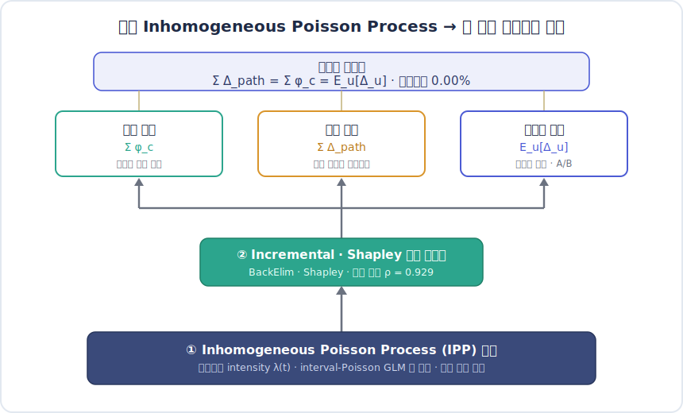
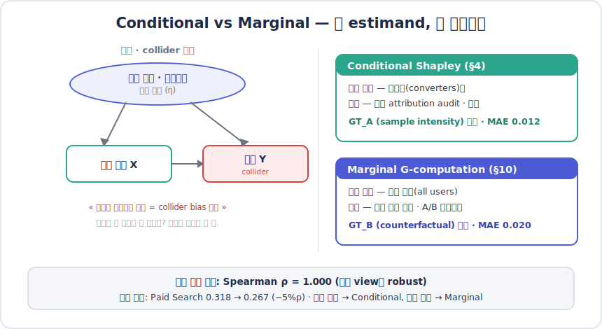
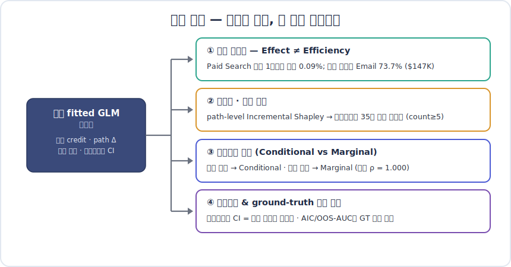

<!-- LANG-TOGGLE -->
**🇰🇷 한국어** · [🇺🇸 English](README.en.md)

# 하나의 생존모형으로 채널 기여도·예산·여정 설계를 동시에

### 단일 Inhomogeneous Poisson Process 위에 Incremental·Shapley 기여도와 path-level 분해를 통합한 인과 기반 Multi-Touch Attribution

<p align="center">
  
  
  
  
  
</p>

> **한 줄 요약.** "광고가 없었다면 이 전환은 일어나지 않았을까?"에 답하기 위해, 마케팅 여정을
> **time-to-event(생존) 데이터**로 보는 단일 **Inhomogeneous Poisson Process(IPP)** 를 세우고 — 그 위에
> **Incremental·Shapley 채널 기여도**와 **path-level(여정 단위) 분해**를 얹었다. *시뮬레이션 ground truth*
> 기준 18개 방법 중 **채널 기여도 오차(MAE)가 가장 작으면서(0.016)**, 동일한 한 모델이 **채널 예산 · 여정 설계
> · 전향적 인과 의사결정** 세 가지를 *하나의 효율성 항등식* 아래 답한다.

---

## ⏱️ 30초 요약 (TL;DR)

<p align="center">
  
  <br><sub><b>그림 1.</b> 단일 <b>Inhomogeneous Poisson Process</b>(백본) 위에 credit 층과 path 층을 얹어,
  채널 예산 · 여정 설계 · 모집단 효과 세 관점을 <b>하나의 효율성 항등식(상대오차 0.00%)</b>으로 통일한다. 이것이 이 방법론의 핵심 주장이다.</sub>
</p>

- **무엇을 만들었나** — Shender et al.(2023)의 생존분석 백본(**Inhomogeneous Poisson Process**)과 Du et al.(2019)의
  Incremental Shapley를 *하나의 적합 모델*로 통합하고, 여기에 **path-level Incremental Shapley**(여정 단위 분해)와
  **Conditional vs Marginal G-computation**(두 estimand)을 추가한 인과 기반 MTA.
- **왜 중요한가** — 기존 MTA는 *상관*에 답한다(Last Click, Shapley). 우리는 *인과*("이 채널이 없었다면?")에
  답하면서도, A/B 테스트 없이 **관측 데이터만으로** 채널 효과·시간 감쇠·시너지·incremental lift를 분리한다.
- **무엇을 보였나** — ground truth 대비 **최저 MAE 0.016**(18개 중 1위) + **2위 예산배분 정확도(MAE 0.019)** +
  고정확도 방법 중 드물게 낮은 부트스트랩 변동성(method-level mean CV 0.13 — 동급 Incremental·Total Shapley는 0.60·0.99로 불안정).
  그리고 channel·path·population 세 관점이 **0.00% 오차로 일치**(효율성 항등식).

> 📖 **읽는 깊이를 고르세요.** 30초 → 위 요약 · 5분 → [문제](#1-문제-왜-기존-mta로는-부족한가)·[방법](#2-방법론-왜-이-3층-구조인가)·[임팩트](#3-임팩트-정직한-결과)·[산업 활용](#4-산업에서-어떻게-쓰는가) ·
> 30분 → [한계](#5-한계와-정직한-스코핑)·[재현](#6-재현-quick-start)·[부록: 11개 실험](#부록-11개-실험-갤러리) + [`docs/Methodology_*`](../docs).

---

## 1. 문제 — 왜 기존 MTA로는 부족한가

분기 마케팅 회의. A/B 테스트 결과는 없고, "어떤 채널이 전환을 만들었나, 다음 분기 예산을 어떻게 옮길까"를
보고해야 한다. 이때 흔히 쓰는 attribution은 네 가지 한계를 동시에 갖는다.

| 한계 | 내용 | 어떤 방법이 걸리나 |
|---|---|---|
| **상관 ≠ 인과 (교란)** | 충성 유저는 Email을 많이 받고(노출) *동시에* 원래 전환을 잘함(η↑). Email의 raw credit이 부풀려진다. | Last Click, Linear, Markov, Total Shapley |
| **시간을 무시** | 터치가 *언제* 일어났는지, 효과가 얼마나 빨리 감쇠하는지 못 본다. 임의의 lookback window에 의존. | 규칙기반 전반 |
| **시너지 비포착** | "Display → Paid Search" 같은 채널 간 교차 영향을 단일 채널 크레딧으로 못 잡는다. | 규칙기반, 1차 Markov |
| **예측 ≠ 설명** | LSTM·Transformer는 전환을 잘 *예측*하지만, attention 가중치가 *인과 기여도*와 일치한다는 보장이 없다. | 딥러닝 attribution |

> **핵심 질문**: *"이 채널의 광고가 없었다면, 이 전환이 일어나지 않았을까?"* — 상관이 아니라 **incremental(순증)**
> 효과. 이를 관측 데이터만으로 추정하려면, 여정을 *시점이 있는 사건열*로 모델링하고 baseline 전환을 빼야 한다.

---

## 2. 방법론 — 왜 이 3층 구조인가

이 프로젝트의 척추는 **하나의 fitted Inhomogeneous Poisson Process(IPP) 위에 세 개의 층을 쌓은 것**이다. 핵심은
*모델을 한 번만 적합하고*, 그 위에서 채널 기여도·여정 분해·모집단 효과를 **모두 동일한 게임**으로 도출한다는 점이다.
전체 구조는 위 **그림 1**(3층 스택 + 효율성 항등식)을 참조.

### 2.1 백본 — 왜 Inhomogeneous Poisson Process인가

마케팅 여정은 본질적으로 **time-to-event 데이터**다. 터치의 영향은 시간에 따라 감쇠하고, 관측 창은 유저마다
다르며("8시간 내 전환 없음" ≠ "효과 0"), 전환은 드물게(2.3%) 일어난다. 스냅샷 로지스틱 회귀는 이 구조를 버린다.

- **모델 클래스 = Inhomogeneous Poisson Process**: 전환을 *시간에 따라 변하는 intensity* $\lambda(t)$ 를 갖는
  Poisson process로 본다.

  $$\log \lambda_i(t) \;=\; \alpha_0 \;+\; \sum_{j}\sum_{k} \beta_k \cdot x_{jk}\cdot f_{\text{channel}}(t-t_j)$$

- **추정**: 각 터치포인트를 시간 구간으로 쪼개 **interval-split Poisson GLM**(offset = log Δt)으로 적합한다 —
  *GLM은 추정 기법*이지 모델 클래스 이름이 아니다. 우측 절단(right-censoring)이 자연스럽게 처리된다.
- **데이터가 말하게 한다**: 채널별 5-bin 감쇠 곡선을 *학습*한다 — Paid Search는 ~1일 만에 식고, Display는
  ~14일까지 남는다(아래 그림 2). 임의의 lookback window를 가정하지 않는다.
- **GT를 안 본다**: 스펙 선택은 **AIC**로(`+Position` 채택, ΔAIC −435 vs baseline), 적합도는 Deviance/df,
  예측력은 hold-out으로 — *ground truth 없이* 모델을 고른다(배포 가능성의 핵심).
- **왜 백본으로**: 단 하나의 IPP가 적합되므로, 이후 모든 기여도·여정·모집단 분해가 *같은 모델의 다른 질의*가 된다.

<p align="center">
  
  <br><sub><b>그림 2.</b> IPP가 데이터에서 <i>학습</i>한 채널별 감쇠(β, log-intensity 기여). Paid Search는 0–1일에 가장 강하다가
  급감(효과적 수명 ~1일), Display는 2주까지 완만히 유지 — lookback window를 가정하지 않고 시간 구조를 직접 추정.</sub>
</p>

### 2.2 채널 기여도 — 왜 백본 위에 Incremental·Shapley를 얹나

적합된 intensity $\hat\lambda$는 아직 "채널 크레딧"이 아니다. 이를 채널별 기여로 분해하기 위해 **같은 IPP 위에서
두 개의 credit 연산자**를 정의한다.

| 연산자 | 정의 | 성질 | 실무 용도 |
|---|---|---|---|
| **BackElim** | 광고를 *나중→처음* 순서로 제거하며 $\hat\lambda$ 하락분을 크레딧으로 | 순서 의존 · 각 채널 기여의 합 = $\hat\lambda(\text{full})-\hat\lambda(\varnothing)$ (잔차 없음) | 입찰(last-touch 집중) |
| **Shapley** | 128개 coalition에 대한 한계기여 평균 | 순서 무관 · coalition-fair · efficiency axiom(§2.3) | 예산 배분 |

두 연산자의 채널 **순위 합의도는 Spearman ρ = 0.929**(그림 3) — 합의가 높으면 보고 가능한 robust 신호, 크게
갈리면 시너지가 큰 채널이라는 진단 신호가 된다. 예: Paid Search는 BackElim 0.45 vs Shapley 0.32 — **BackElim은
마지막 터치(Paid Search)에 크레딧을 집중**시키고 **Shapley는 coalition 전체에 분산**시키기 때문이다.
(수식 유도: [`Methodology_05`](../docs/Methodology_05_Causal_Attribution_Frameworks.md) Eq. 13·25.)

<p align="center">
  
  <br><sub><b>그림 3.</b> 같은 IPP 위 두 credit 연산자(BackElim·Shapley)의 채널 기여도. 순위 합의 ρ=0.929 — robust한 신호.</sub>
</p>

**왜 "incremental"인가 (Total Shapley와의 차이).** Total Shapley는 baseline 전환(광고가 전혀 없어도
일어났을 전환)까지 크레딧에 포함한다. 그래서 high-intent 유저를 타고 가는 lower-funnel 채널(Paid Search,
Email)을 과대평가하고, **base 전환율이 높아지면 upper-funnel 채널(Display·Social)의 Total 크레딧이 0으로
붕괴**한다(실험 06: high base에서 Display Total = 0.00 vs Incremental = 0.080). Incremental Shapley는
baseline을 빼서 **광고가 만든 순증 lift만** 격리한다.

### 2.3 Multi-path — 왜 path-level 분해를 만들었나

채널 관점(§2.2)은 "어느 채널에 돈을 쓸까"에 답한다. 하지만 마케터는 "**어떤 N-step 여정이 incremental 전환을
가장 많이 만드나**"도 묻는다 — 예산이 아니라 **캠페인/여정 설계**의 질문이다.

- **같은 IPP, 다른 집계 단위**: 채널이 아니라 *여정 템플릿(ordered channel tuple)* 단위로
  $\Delta_{\text{path}} = \hat\lambda(\text{path}) - \hat\lambda(\varnothing)$를 합산.
- **효율성 항등식이 세 관점을 통일**한다 — 검증 결과 **상대오차 0.00%**:

  $$\underbrace{\textstyle\sum_{\text{paths}} \Delta_{\text{path}}}_{\text{여정 설계}} \;=\; \underbrace{\textstyle\sum_{c} \phi_c}_{\text{채널 예산}} \;=\; \underbrace{\mathbb{E}_u[\Delta_u]}_{\text{모집단 효과}} \;=\; 6.99\times 10^{-2}$$

  즉 채널 예산·여정 설계·모집단 인과효과는 *서로 다른 분석이 아니라 같은 게임의 세 가지 집계*다.
- **재현 가능한 것만 남긴다**: 전체 1,786개 고유 템플릿 중 ~98%가 1명짜리 우연한 긴 여정(count=1). `count ≥ 5`
  필터로 **35개 robust 템플릿**(전환자의 15.5% 커버)만 캠페인 후보로 남긴다(그림 4).

<p align="center">
  
  <br><sub><b>그림 4.</b> path-level Incremental Shapley로 ranking한 35개 robust 여정. <b>왼쪽(Total Contribution)</b>은
  많이 일어나 합이 큰 여정 — Email→Paid Search(n=37)·Direct→Paid Search(n=24) 등 짧고 빈번한 2-step.
  <b>오른쪽(Mean Δ)</b>은 드물어도 한 건 임팩트가 큰 3-step 여정. 색=여정 길이(touchpoint 수).</sub>
</p>

### 2.4 Conditional vs Marginal — 왜 두 개의 estimand인가

동일한 Shapley 크레딧을 **누구에 대해 집계하느냐**에 따라 두 가지 인과량(estimand)이 나온다.

<p align="center">
  
  <br><sub><b>그림 5.</b> 전환에 조건부(converters-only)로 집계하면 collider bias가 들어온다. 과거 정산은 Conditional, 미래 예산은 Marginal.</sub>
</p>

| Estimand | 집계 대상 | 답하는 질문 | GT 정합 |
|---|---|---|---|
| **Conditional Shapley** (§4) | 전환자만 | "전환한 유저의 채널 credit 분배" — 사후 audit | GT_A(sample intensity), MAE **0.012** |
| **Marginal G-comp** (§10) | **전체 유저** | "이 채널 예산 ↓ 시 모집단 전환 감소?" — 전향 결정·A/B 정렬 | GT_B(counterfactual), MAE **0.020** |

> **왜 구분이 중요한가 (구급차 비유)**: 응급실 환자만 보고 "구급차 탄 사람이 더 자주 죽는다"고 하면 안 된다 —
> 위중한 사람이 구급차를 탄 것. 전환에 조건부로 집계하는 것은 **collider bias**다. 실제로 16–20 step 유저의
> **96.3%는 전환하지 않으며**, New 세그먼트 안에서도 긴 여정이 3.8배 더 전환한다(selection, not causation).
>
> Marginal이 복원하는 **GT_B는 채널을 *do(제거)*했을 때의 counterfactual — 곧 A/B 테스트가 측정하려는 바로 그
> estimand**이며, 본 시뮬에서 MAE 0.020으로 복원된다(Conditional은 converters-only인 GT_A에 MAE 0.012로 정합).
>
> 두 view의 **채널 순위는 완전히 일치(ρ = 1.000)**하지만 크기는 다르다 — **Paid Search가 Conditional 0.318 →
> Marginal 0.267 (−5%p)**. ⇒ *예산 결정은 Marginal, 사후 정산은 Conditional.*

---

## 3. 임팩트 — 정직한 결과

ground truth(알려진 DGP 파라미터) 대비 18개 방법을 평가했다. 메인 방법론은 **정확도·안정성·의사결정
정확도의 조합**에서 앞선다 — 단일 지표의 silver bullet이 아니다.

<p align="center">
  
  <br><sub><b>그림 6.</b> ground-truth 대비 오차(MAE, ↓좋음) × 순위 일치도(Kendall τ, ↑좋음).
  인과·incremental 계열(좌상단)이 First Click·Transformer 같은 휴리스틱/예측-only(우하단, 음의 τ)와 분리된다.</sub>
</p>

| 방법 | 채널 MAE ↓ | Kendall τ ↑ | 예산배분 MAE ↓ | 부트스트랩 mean CV ↓ | 계열 |
|---|---|---|---|---|---|
| **Survival/Poisson (Shapley)** ⭐ | **0.016** (18개 중 1위) | 0.905 | 0.019 (2위) | **0.13** | Causal (incremental) |
| Survival/Poisson (BackElim) | 0.046 | **1.000** | 0.083 | — | Causal (incremental) |
| Incremental Shapley (Du) | 0.029 | 0.905 | **0.013** (1위) | 0.60 ⚠️ | Causal (incremental) |
| CAMTA (Causal Attention) | 0.023 | 0.905 | 0.036 | 0.10 | Causal DL |
| LSTM+Attention (LOO) | 0.028 | **1.000** | 0.077 | — | Deep Learning |
| Shapley (model-based, *Total*) | 0.035 | 0.905 | 0.117 ⚠️ | 0.99 ⚠️ | Game-theoretic |
| Last Click | 0.038 | 0.810 | 0.054 | 0.31 | Rule-based |
| DML / IPW | 0.050 / 0.074 | 0.524 / 0.333 | 0.045 / 0.090 | 0.93 / 0.66 | Causal (debiased) |
| Transformer (2L/2H) | 0.100 ❌ | −0.333 ❌ | — | 0.59 | Deep Learning |
| First Click | 0.158 ❌ | −0.293 ❌ | — | 0.14 | Rule-based |

*(출처: [`01_method_accuracy.csv`](../results/part1/01_method_accuracy.csv), [`07_budget_optimization.csv`](../results/part1/07_budget_optimization.csv), [`10_bootstrap_stability.csv`](../results/part1/10_bootstrap_stability.csv). 부트스트랩 CV = 채널별 CV의 method-level 평균. `—` 는 해당 변형이 부트스트랩 대상이 아님 — BackElim은 AICPE·Shapley 변형으로, LSTM은 attn-weights 변형(0.13)으로 부트스트랩됨.)*

#### 정직하게 짚을 네 가지 ★

1. **"최고"는 정밀하게.** Survival/Poisson (Shapley)는 *오차 1위(0.016)*면서 *변동성도 낮은(mean CV 0.13)* 드문
   방법이다 — 같은 고정확도 그룹의 Incremental Shapley(0.60)·Total Shapley(0.99)는 변동성이 크고, 가장 안정적인
   Markov(~0.04)는 정확도가 낮다. 즉 *정확도+안정성+배분의 조합*에서 앞서며 단일 축의 만능 해법이 아니다.
   (CAMTA가 MAE 0.023·CV 0.10으로 근접한 경쟁자.)
2. **인과 ≠ 자동 우승.** debiased 추정기(**DML 0.050, IPW 0.074**)는 이 DGP에서 **최고 규칙기반(Last Click
   0.038)을 못 이긴다** — 교란이 중간 수준이라 무거운 debiasing이 이득을 못 본다. 승부처는 *IPP + incremental
   모델링 자체*이지 propensity 보정이 아니다. (실험 05)
3. **Total Shapley = 깨지기 쉬운 승자.** 채널 MAE는 0.035로 괜찮지만 **예산배분 MAE 0.117, mean CV 0.99**(거의
   최악)로 불안정하다. 정확도만 보면 놓치는 위험이다.
4. **최고 규칙기반은 의외로 경쟁적.** Last Click의 MAE(0.038)는 나쁘지 않다. 인과 계열의 진짜 우위는
   *순위·배분·안정성을 동시에* 만족하고 **해석 가능한 산출물**(감쇠 곡선, 시너지, incremental vs total)을 준다는 점이다.

<p align="center">
  
  <br><sub><b>그림 7.</b> base 전환율이 오르면 Total Shapley는 Display·Social에서 0으로 붕괴하지만 Incremental은 안정.
  방법별 안정성(mean CV) 수치는 위 표(<a href="../results/part1/10_bootstrap_stability.csv">10_bootstrap_stability.csv</a>) 참조.</sub>
</p>

---

## 4. 산업에서 어떻게 쓰는가

이 방법론의 산출물은 *네 가지 의사결정*에 바로 연결된다. 핵심은 **하나의 fitted IPP가 네 질문에 모두 답한다**는 것.

<p align="center">
  
  <br><sub><b>그림 8.</b> 같은 IPP의 산출물이 예산·여정·전향 결정·불확실성 네 갈래로 연결된다.</sub>
</p>

### 4.1 예산 재배분 — "Effect ≠ Efficiency"

가장 강한 효과의 채널이 *돈당 효율*은 최악일 수 있다. attribution을 비용 구조에 결합해야 비로소 배분 결정이 된다.

| 채널 | 효과 (β) | 효과 순위 | 비용/터치 | **효율 (전환/$)** | **GT 최적 예산** |
|---|---|---|---|---|---|
| **Paid Search** | 1.2 | **1위** | $2.50 (CPC) | **0.19 (꼴찌)** | **0.09% ($181)** |
| **Email** | 0.8 | 2위 | $0.003 | **152.7 (1위)** | **73.7% ($147,345)** |
| Social | 0.4 | 6위 | $0.008 (CPM) | 16.1 | 7.8% ($15,505) |
| Display | 0.3 | 7위 | $0.005 (CPM) | 38.3 | 18.5% ($36,969) |

*(출처: [`ground_truth.json`](../results/part1/ground_truth.json) — total budget $200K, revenue/conversion $100. 효과 순위는 7개 채널 β 전체 기준; 표에는 4개 paid 채널만 발췌.)*

<p align="center">
  
  <br><sub><b>그림 9.</b> Paid Search는 효과 1위지만 CPC가 비싸 최적 예산은 0.09%; 진짜 가치 동력은 Email(73.7%).
  Incremental Shapley·Survival/Poisson Shapley가 GT 최적 배분에 가장 근접.</sub>
</p>

> **왜 인과·incremental가 필요한가**: Last Click·Linear·Total Shapley는 모두 Paid Search에 과배분한다.
> incremental lift를 효율과 결합한 방법(Incremental Shapley 배분 MAE **0.013**, Survival/Poisson Shapley
> **0.019**)만이 Email을 진짜 가치 동력으로 식별한다.

### 4.2 캠페인·여정 설계 — 재현 가능한 35개 여정 템플릿

path-level Incremental Shapley(§2.3, 그림 4)는 *어떤 여정 패턴이 incremental 전환을 만드나*를 ranking한다.
`count ≥ 5`로 거른 **35개 robust 템플릿**(대부분 짧고 빈번한 2-step, 예: Email→Paid Search·Direct→Paid Search)은
"지금 작동하는" 여정 — 증폭(amplify) 우선순위가 된다. 채널 예산과 여정 설계가 **같은 효율성 항등식** 아래
정합하므로, 두 결정이 모순되지 않는다.

### 4.3 의사결정 규칙 — 과거는 Conditional, 미래는 Marginal

| 의사결정 | 시간 방향 | 사용할 view |
|---|---|---|
| "지난 분기 무엇이 전환을 만들었나" (정산·audit) | 과거 | **Conditional** (§4) |
| "Email 예산 10%↓ 시 전환 손실은?" (재배분) | 미래 | **Marginal G-comp** (§10) |
| A/B 테스트 사전 효과 크기 추정 | 미래 | **Marginal** (A/B estimand와 정렬) |
| 캠페인 시나리오 디자인 | 양쪽 | 둘 다 |

순위가 ρ=1.000으로 일치하므로 *어느 쪽이든 robust*하되, 크기가 갈리는 예산 결정에서는 Marginal을 권장한다.
→ 1-page 실무 가이드: [`docs/Marketing_Handout_Conditional_vs_Marginal.md`](../docs/Marketing_Handout_Conditional_vs_Marginal.md).

### 4.4 불확실성 & ground-truth 없는 배포

- **보고 신뢰도 게이트**: 부트스트랩 90% CI 폭으로 채널을 분류 — 좁으면 보고 가능, 넓으면(0 포함) 보수적 framing.
- **GT 없이 작동**: 실데이터엔 ground truth가 없다. 이 방법론은 AIC(스펙 선택) · OOS AUC(예측 sanity) ·
  내부 정합성(BackElim↔Shapley ρ, 효율성 항등식)으로 *스스로 검증*한다.

<p align="center">
  
  <br><sub><b>그림 10.</b> 메인 방법론의 OOS holdout ROC — <b>AUC 0.671</b>(80/20 user split, notebook §6). 18개 방법을
  같은 harness로 비교한 실험 08에서는 OOS AUC가 ~0.64로 군집한다(평가 설정이 달라 값이 다름). 어느 쪽이든
  "예측력이 무너지지 않았다"는 *reasonableness 게이트*로 쓴다 — attribution의 인과적 타당성을 증명하진 않는다.</sub>
</p>

---

## 5. 한계와 정직한 스코핑

- **교란 무가정에 의존.** 모든 estimand는 outcome model + 충분한 confounder set $W$를 가정한다. **A/B 테스트가
  여전히 최종 기준**이며, 관측 분석은 의사결정 *지원* 도구이지 증명이 아니다.
- **모델–DGP 정합이 중요.** 생존모형은 Markov 형태의 DGP에서는 catastrophic하게 무너진다(Methodology_06에선
  Time Decay가 MAE 1위). 어떤 방법도 모든 DGP에서 이기지 않는다 — "home advantage"가 있다.
- **다변량 이질성 회복은 약하다.** segment+device를 넣어도 MAE 개선이 noise floor 수준 → **propensity 가중
  생존모형(DR/DML 하이브리드, Tier 2)**이 다음 과제다.
- **예측력은 modest.** OOS AUC가 ~0.64에서 방법 간 군집한다(실험 08, 교차-방법) — 예측검증은 방법을 *가르는*
  도구가 아니라 *기각하는*(너무 낮으면 신뢰 불가) reasonableness 게이트로만 쓴다.
- **시뮬레이션이다.** ground truth의 대가는 합성 데이터라는 점. 다음 단계는 **Criteo 16.5M 이벤트** 스케일 검증(Part 2).

---

## 6. 재현 (Quick Start)

```bash
# 0) 설치
pip install -e ".[dev]"

# 1) 시뮬레이션 데이터 생성 (100K users, 7 channels, ground truth 포함)
python part1_simulation/dgp/generate_data.py \
    --n-users 100000 --config configs/dgp/default.yaml \
    --output-dir data/simulation

# 2) 메인 인과 방법론 실행 (IPP/Survival + Incremental Shapley + multi-path)
python part1_simulation/models/causal/run_all.py \
    --data-dir data/simulation --output-dir results/part1/causal

# 3) ground truth 대비 18개 방법 평가
python part1_simulation/experiments/evaluate.py \
    --results-dir results/part1 --ground-truth data/simulation/ground_truth.json
```

대화형 분석은 노트북으로 따라가는 것을 권장한다 — 읽는 순서는
**Setup(01) → Main(02) → Benchmark(03–06) → Validation(07–08)**:
[`notebooks/part1/README.md`](../notebooks/part1/README.md)가 단일 출처(읽는 순서·실험 ID↔노트북 매핑·주제별 owner).

### 저장소 구조 (Part 1)

```
part1_simulation/
├── dgp/                         # Du(2019)+Shender(2023)+CDA(2025) 통합 DGP
│   ├── conversion_model.py      #   log-linear intensity (β, f_channel, δ, η)
│   └── generate_data.py         #   100K 여정 생성 + ground_truth.json
├── models/
│   ├── rule_based.py · markov.py · shapley.py        # 벤치마크 (baseline)
│   ├── lstm_attention.py · transformer.py            # 딥러닝 벤치마크
│   └── causal/
│       ├── survival_attribution.py   # ★ Inhomogeneous Poisson Process 백본 (interval-Poisson GLM)
│       ├── _survival_credits.py      # ★ BackElim · Shapley · AICPE 크레딧
│       ├── _survival_paths.py        # ★ path-level Incremental Shapley (multi-path)
│       ├── incremental_shapley.py    # Du(2019) Incremental Shapley
│       └── propensity.py · dml.py · camta.py         # IPW/DR · DML · Causal Attention
├── evaluation/ · optimization/  # GT 메트릭 · 예산 최적화
└── experiments/                 # 실험 01–11 (ID 불변)
```

### 더 깊이 — 방법론 문서

| 문서 | 내용 |
|---|---|
| [`Methodology_05_Causal_Attribution_Frameworks.md`](../docs/Methodology_05_Causal_Attribution_Frameworks.md) | **메인 과학 문서** — Shender+Du 통합, §3.4 채널↔path 쌍대성, §3.5 Conditional vs Marginal |
| [`Methodology_05b_Practitioner_Summary.md`](../docs/Methodology_05b_Practitioner_Summary.md) | 비기술 이해관계자용 요약 |
| [`Methodology_00_Method_Changelog.md`](../docs/Methodology_00_Method_Changelog.md) | 방법 버전 이력(v1/v2/v3 폐기 사유 — 정본) |
| [`Methodology_01_DGP_Design.md`](../docs/Methodology_01_DGP_Design.md) · [`_03_`](../docs/Methodology_03_Experimental_Design.md) · [`_04_`](../docs/Methodology_04_Cost_Structure_Budget_Optimization.md) · [`_06_`](../docs/Methodology_06_DGP_Robustness.md) · [`_07_`](../docs/Methodology_07_Multivariate_Recovery.md) | DGP 설계 · 실험 설계 · 비용/예산 · DGP 강건성 · 다변량 회복 |
| [`docs/GLOSSARY.md`](../docs/GLOSSARY.md) | 용어 단일기준 (한/영) |

### References

- **Du et al.** (2019), *Causally Driven Incremental Multi-Touch Attribution Using a RNN*, AdKDD (arXiv:1902.00215)
- **Shender et al.** (2023), *A Time-To-Event Framework for Multi-Touch Attribution*, J. Data Science 22
- **CDA** (2025), *Causal-driven Attribution: Estimating Channel Influence Without User-level Data* (arXiv:2512.21211)
- **Chernozhukov et al.** (2018), *Double/Debiased Machine Learning*, Econometrics Journal

---

## 부록: 11개 실험 갤러리

<details>
<summary><b>실험 01–11 펼치기</b> (그림·CSV·연결 문서)</summary>

| # | 실험 | 핵심 발견 | 산출물 |
|---|---|---|---|
| 01 | 방법 정확도 비교 | Survival/Poisson Shapley 최저 MAE 0.016 (18개 중) | [`01_method_accuracy.csv`](../results/part1/01_method_accuracy.csv) · [그림](../results/part1/01_mae_vs_tau.png) |
| 02 | 시너지 포착 | Display→Paid Search(δ=0.4) 검출; Markov는 둔감 | [`02_interaction_effects.csv`](../results/part1/02_interaction_effects.csv) |
| 03 | 데이터 규모 민감도 | 방법별 데이터 요구량 상이 (생존모형 ~10K 수렴) | [`03_data_scale.csv`](../results/part1/03_data_scale.csv) |
| 04 | DGP 가정 민감도 | 생존모형 변형 DGP에 robust (decay 제거 시 Shapley 개선) | [`04_dgp_sensitivity.csv`](../results/part1/04_dgp_sensitivity.csv) |
| 05 | 상관 vs 인과 | 중간 교란에선 debiased가 correlational 못 이김 | [`05_correlational_vs_causal.csv`](../results/part1/05_correlational_vs_causal.csv) |
| 06 | Incremental vs Total | high base에서 Total은 0 붕괴, Incremental 안정 | [`06_incremental_vs_total.csv`](../results/part1/06_incremental_vs_total.csv) |
| 07 | 예산 최적화 | Incremental Shapley 배분 MAE 0.013 (1위) | [`07_budget_optimization.csv`](../results/part1/07_budget_optimization.csv) |
| 08 | OOS 예측 검증 | AUC ~0.64 군집; GT-MAE↔OOS-AUC 강한 음의 상관 | [`08_predictive_validation.csv`](../results/part1/08_predictive_validation.csv) |
| 09 | 의사결정 임팩트 | 배분→매출 lift; "+lift"가 배분 실패의 artifact일 수 있음 | [`09_decision_impact.csv`](../results/part1/09_decision_impact.csv) |
| 10 | 부트스트랩 안정성 | Markov·Survival 안정, model-based Shapley fragile | [`10_bootstrap_stability.csv`](../results/part1/10_bootstrap_stability.csv) |
| 11 | 수렴 타당성 (GT-free) | 단일 최고 방법이 consensus보다 우수 | [`11_convergent_validity.csv`](../results/part1/11_convergent_validity.csv) |

각 실험의 데이터(CSV)는 [`results/part1/`](../results/part1/)에 있다 — 핵심 그림은 본문(그림 1–10)에 임베드.

</details>

---

<sub>이 문서는 <b>committed 결과물(`results/part1/*.csv`, `ground_truth.json`)</b>의 정본 수치만 사용하며,
실패·약한 결과(First Click·Transformer 음의 τ, debiased의 비우위, Total Shapley fragility, Markov DGP 붕괴)를
그대로 보고한다. 본문 일부 figure(그림 2 감쇠 곡선 등)는 notebook 02 원본 출력으로 축 라벨 일부가 한국어다.
· <a href="README.en.md">English version →</a></sub>
